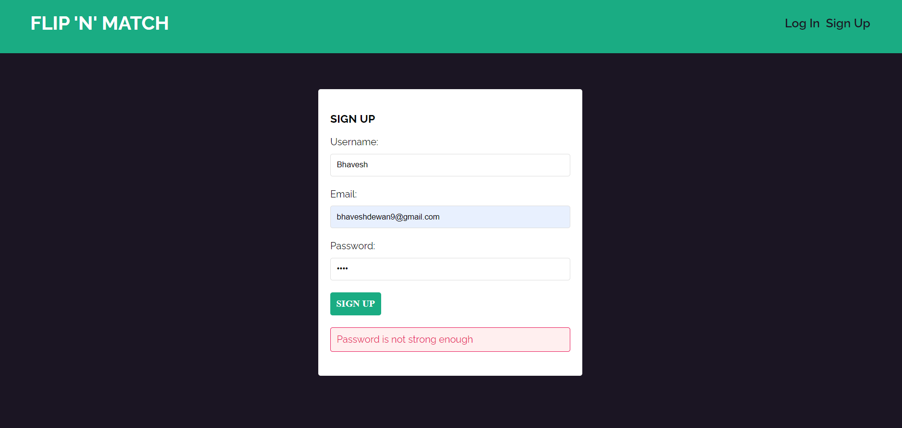

**Flip-N-Match Memory Game**
Welcome to the Flip-N-Match Memory Game! This is a fun and interactive memory game where you need to flip and match pairs of Pokémon cards. The game is built using the MERN (MongoDB, Express, React, Node.js) stack.

**Features**
Flip and match pairs of Pokémon cards
Timer to track how long it takes to complete the game
Scoreboard to keep track of the best scores

**Technologies Used**
Frontend:
React.js
HTML5
CSS3

Backend:
Node.js
Express.js

Database:
MongoDB

**Installation**
 1) Clone the repository:
git clone https://github.com/yourusername/flip-n-match.git
cd flip-n-match
Install backend dependencies:

2. cd ../backend
npm install
Install frontend dependencies:

3. cd ../frontend
npm install
Usage
Set up environment variables:

4) Create a .env file in the backend directory and add the following:
PORT=5000
MONGO_URI=your_mongodb_connection_string

5) Run the backend server:
cd ../backend
npm run dev
Run the frontend server:

6) cd ../frontend
npm start
Open your browser:

7) Navigate to http://localhost:3000 to start playing the game.

**Screenshots from the game**

**LOGIN SCREEN** (with incorrect email and password identification)

**SIGN UP SCREEN** (Weak password and incomplete field detection)

**HOME SCREEN** 

**HOME SCREEN WHEN NEW GAME BUTTON IS CLICKED**

**FLIPPING POKEMON CARDS**

**WINNING POPUP**

**SCOREBOARD UPDATE**

**MongoDB DATABASE** (With password encryption)

**API CALLS**

